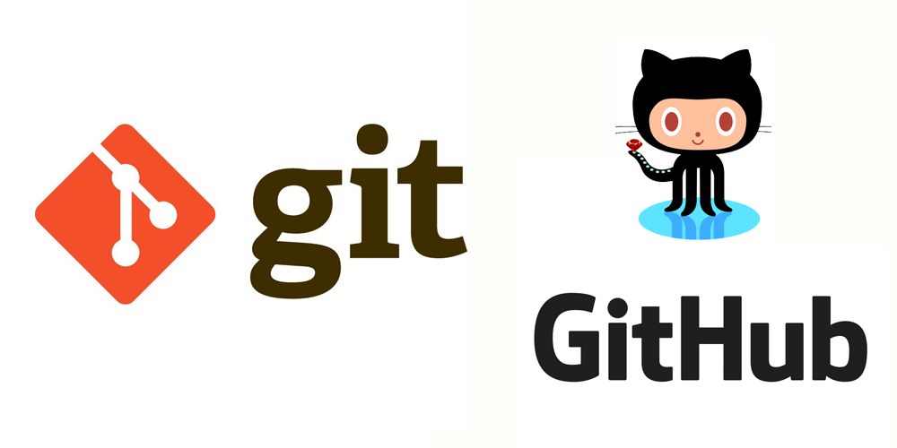

# 1. Что такое Git?

**Git — это система контроля версий (VCS), которая позволяет сохранять и отслеживать изменения в файлах с течением времени без перезаписи предыдущих снимков.**

Это помогает разработчикам совместно работать над проектами.

В отличие от своего основного конкурента — __SVN__ , Git также реализует систему распределенного рабочего процесса. Это означает, что у каждого разработчика, работающего с Git, есть локальная копия всего репозитория. Git также позволяет работать асинхронно без постоянного подключения к центральному репозиторию.

[Вернуться назад](../readme.md)